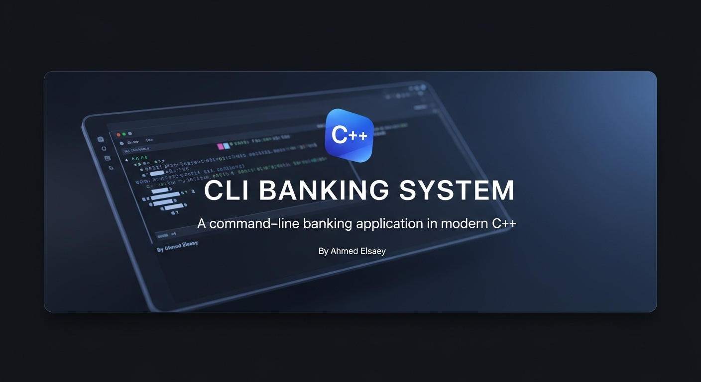

<!-- Banner -->
<p align="center">
  <a href="https://github.com/ahmedelsaey1/CLI-Banking-System">
    
  </a>
</p>

<!-- Badges -->
<p align="center">
  <a href="https://github.com/ahmedelsaey1/CLI-Banking-System/stargazers"></a>
  <a href="https://github.com/ahmedelsaey1/CLI-Banking-System/network/members"></a>
  <a href="https://github.com/ahmedelsaey1/CLI-Banking-System/blob/main/LICENSE"></a>
  <a href="https://github.com/ahmedelsaey1/CLI-Banking-System/issues"></a>
</p>

Welcome to the **CLI Banking System**, a lightweight yet powerful console-based banking app crafted with modern C++ and designed for simplicity, scalability, and educational purposes.

<p align="center">
  
  
</p>

---

<h1 align="center">CLI Banking System</h1>

<p align="center">
  A robust, feature-rich, and secure command-line banking application built with modern C++.
  </p>
  <p align="center">
  <a href="#-key-features"><strong>Explore the features »</strong></a>
  ·
  <a href="https://github.com/ahmedelsaey1/CLI-Banking-System/issues/new/choose">Report a Bug</a>
  ·
  <a href="https://github.com/ahmedelsaey1/CLI-Banking-System/issues/new/choose">Request a Feature</a>
</p>

---

## 📖 Table of Contents

- [About The Project](#-about-the-project )
- [Key Features](#-key-features)
- [Project Architecture](#-project-architecture)
- [Getting Started](#-getting-started)
  - [Prerequisites](#prerequisites)
  - [Build and Run](#build-and-run)
- [Contributing](#-contributing)
- [License](#-license)
- [Acknowledgements](#-acknowledgements)

---

## 🏛️ About The Project

The **CLI Banking System** is a C++ console application designed to simulate core banking functionalities in a clean, efficient, and user-friendly command-line environment. It serves as a practical example of procedural programming, data persistence using file streams, and robust error handling.

This project was developed not just as a coding exercise, but as a template for building scalable and maintainable console-based applications.

---

## ✨ Key Features

- **Full CRUD Functionality:** Create, Read, Update, and Delete client records.
- **Transactional Operations:** Securely handle deposits and withdrawals.
- **Data Persistence:** Client data is saved to and loaded from a `.txt` file, ensuring data is not lost between sessions.
- **Input Validation:** Robust checks to prevent invalid data entry and runtime errors.
- **Modular Design:** Code is organized into logical functions, each with a single responsibility.
- **User-Friendly Interface:** A clear and intuitive menu-driven interface for seamless navigation.

---

## 🏗️ Project Architecture

The application follows a procedural programming paradigm, with logic separated into distinct functions for clarity and maintainability.

1.  **Data Layer (`Clients.txt`):** A simple text file acts as the database. Each line represents a client record, with fields separated by a unique delimiter (`#//#`).
2.  **Data Access Logic:** A set of functions is responsible for all file I/O operations (`LoadClientsDataFromFile`, `SaveClientsDataToFile`). This abstracts the file handling from the main business logic.
3.  **Business Logic:** Core operations like `AddNewClient`, `DeleteClientByAccountNumber`, and transaction handling reside in this layer.
4.  **Presentation Layer (UI):** All user-facing menus and display functions (`ShowMainMenu`, `PrintClientCard`) form the UI, making it easy to modify the look and feel without altering the core logic.

---

## 🚀 Getting Started

To get a local copy up and running, follow these simple steps.

### Prerequisites

- A modern C++ compiler (g++ recommended).
- Git for cloning the repository.

### Build and Run

1.  **Clone the repository:**
    ```sh
    git clone https://github.com/ahmedelsaey1/CLI-Banking-System.git
    ```

2.  **Navigate to the project directory:**
    ```sh
    cd CLI-Banking-System
    ```

3.  **Compile the project:**
    ```sh
    g++ main.cpp -o bank_system -std=c++11
    ```

4.  **Run the application:**
    ```sh
    ./bank_system
    ```

---

## 🤝 Contributing

Contributions are what make the open-source community such an amazing place to learn, inspire, and create. Any contributions you make are **greatly appreciated**.

If you have a suggestion that would make this better, please fork the repo and create a pull request. You can also simply open an issue with the tag "enhancement".

1.  **Fork the Project**
2.  **Create your Feature Branch** (`git checkout -b feature/AmazingFeature`)
3.  **Commit your Changes** (`git commit -m 'feat: Add some AmazingFeature'`)
4.  **Push to the Branch** (`git push origin feature/AmazingFeature`)
5.  **Open a Pull Request**

Don't forget to give the project a star! Thanks again!

---

## 📜 License

Distributed under the MIT License. See `LICENSE` file for more information.

---

## 🙏 Acknowledgements

Special thanks to the open-source community and everyone who contributed to making this project better. If you want to be featured here, submit a pull request!

---

## 📬 Contact

Ahmed Elsaey - [linkedin](https://www.linkedin.com/in/ahmed-elsaey1) - a7md.elsaey@gmail.com

- [Project Link](https://github.com/ahmedelsaey1/CLI-Banking-System )